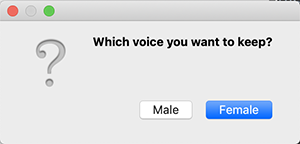
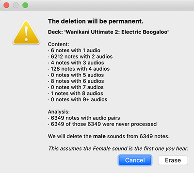

# WK2 Choose One Voice
> Anki add-on to erase one of the two audio speakers coming with the 'WaniKani Ultimate 2: Electric Boogaloo' deck.

## How does it work?
Each note with audio in WK2 has an even number of audios* ordered always in couples Female-Male, in a field named 'Audio'.
The script finds each of those even notes and keeps only the even or the odd audios, depending on what speaker you choose.

When executed, any card with an even number of audios in the 'Audio' field is left as it is.  
Also, since 4 becomes 2, the script adds a · in between the processed audios as a mark to avoid processing them ever again.  
_...so you can use it on the same deck again if you ever get new cards with an update._

_* Actually, a really small part of the notes come with only one (or even three) audios. See the [Analysis](#Analysis) at the bottom._

## How to use it
_Disclaimer: Before doing anything I'd recommend making a backup with the programming info and multimedia, just in case...  
I won't take any responsibility of weird not-expected side effects._  
_However, you can check at the bottom the analysis I made to make sure it works properly._

### Adding the script to anki
1. Find the add-ons folder (```addons21```) in your computer (you can access it from anki at ```tools/add-ons/open addons folder```).
2. Download this repository (you just need the ```choose_one_voice``` folder).
3. Put the ```choose_one_voice``` folder inside the add-ons folder (and restart anki if it was open).

### Executing the script
4. Select the "WaniKani Ultimate 2: Electric Boogaloo" deck in Anki (so that it's the current deck).
5. Go to ```tools/choose one voice (WK2)``` in the Anki menu.
6. Choose which voice you want to keep (male or female).  



_It'll ask for confirmation before erasing stuff._  



7. Once audio references are deleted from the field, you can check for unused media to actually delete the ```.mp3``` files.

### Deleting the unused .mp3 files
8. Go to ```tools/check media``` on the Anki menu.
9. Press ```delete unused``` at the bottom.
10. You can also delete them from the ```media trash``` folder too, if you want.

### Deleting them from the recycling bin too
11. Find the user folder (outside of the add-ons folder there's your folder, probably named ```User 1```).
12. Go inside and find the ```media.trash``` folder.
13. Delete stuff from there (this is all the media files Anki has used in the past but were deleted when choosing ```delete unused```).

## Analysis of WK2 deck content <a name="Analysis"></a>
> Based on 9/6/2020 update

### Audio files
- 6 notes with 1 audios
- 6212 notes with 2 audios
- 4 notes with 3 audios
- 128 notes with 4 audios
- 0 notes with 5 audios
- 8 notes with 6 audios
- 0 notes with 7 audios
- 1 notes with 8 audios
- 0 notes with 9 audios
- 0 notes with 10 audios
- 0 notes with 11 audios

### Manual check
Notes with 3 audios are these (some lack one version, some have one repeated):  
連中 (FM-F), 縮まる (FFM), 洞穴 (FM-M), 肯く (FM-M)

Notes with 6 audios (all ordered FM-FM-FM):  
明日, 悪口, 塩味, 一昨日, 白旗, 冠, 腸, 堪える

There's one note with 8, which is 否 (FM-FM-FM-FM)

I've also checked a random sample of the notes with 2 and 4 audios (16 and 4, respectively), and they were all ordered properly.  
So in principle this add-on should work exactly as expected.
